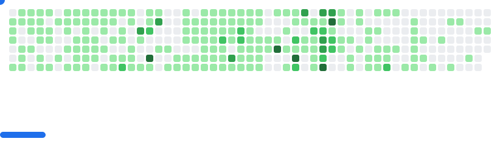

### Xin chào, tôi là Tấn Sang 👋

Tôi là một nhà phát triển phần mềm đến từ Việt Nam, luôn tìm kiếm những thách thức mới và cơ hội để học hỏi. Với nền tảng vững chắc trong các thuật toán và cấu trúc dữ liệu, tôi thích xây dựng các ứng dụng mạnh mẽ và hiệu quả, đặc biệt trong các hệ thống phân tán.

🔭 Tôi hiện đang làm việc với các dự án Backend và Frontend.
🌱 Tôi hiện đang tìm hiểu sâu hơn về kiến trúc hệ thống và Microservices.
📫 Cách liên hệ với tôi: tansang06092004@gmail.com

---

### 💻 Ngôn ngữ & Công cụ

Dưới đây là các ngôn ngữ và công cụ mà tôi đã và đang sử dụng:

**Ngôn ngữ lập trình:**

  
  
  
  
  

**Frameworks & Thư viện:**

  
  
  
  

**Cơ sở dữ liệu:**

  
  

**Công cụ & Môi trường phát triển:**

  
  
  
  
  
  

**Các kỹ năng khác:**
* Thuật toán & Cấu trúc dữ liệu
* Phân tán hệ thống (Replica Set)
* Tích hợp thanh toán (VNPAY)
* Tích hợp OAuth (Google, GitHub Login)
* Quản lý dự án

---

### 🚀 Dự án Nổi bật

Đây là một vài dự án mà tôi tự hào nhất. Bạn có thể tìm thấy thêm chi tiết và mã nguồn trong các repository tương ứng.

* **Hệ thống Đặt Vé Xem Phim Trực Tuyến**
    * **Công nghệ:**    
    * **Mô tả:** Một ứng dụng full-stack cho phép đặt vé xem phim trực tuyến. Sử dụng **MongoDB** với **Replica Set** để phân tán dữ liệu và đảm bảo tính sẵn sàng của hệ thống. Backend phát triển với **Spring Boot** và Frontend với **React**. Tích hợp **VNPAY** cho các giao dịch thanh toán.
    * **Backend Repo:** [https://github.com/cinema-Distributed-database/backend](https://github.com/cinema-Distributed-database/backend)

* **Hệ thống Bán Hàng Công Nghệ Trực Tuyến (Tech Shop)**
    * **Công nghệ:**     
    * **Mô tả:** Nền tảng thương mại điện tử full-stack hỗ trợ các vai trò người mua, người bán và quản trị viên. Backend được xây dựng bằng **Spring Boot** và Frontend với **React**. Tích hợp thanh toán **VNPAY**. Hỗ trợ đăng nhập thông qua **Google** và **GitHub OAuth**. Tự động gửi email xác nhận khi hoàn tất giao dịch.
    * **Backend Repo:** [https://github.com/WEBSITE-QU-N-LI-BAN-HANG-CONG-NGH/BACKEND](https://github.com/WEBSITE-QU-N-LI-BAN-HANG-CONG-NGH/BACKEND)

---

### 📊 Thống kê GitHub của tôi

<picture>
  <source
    media="(prefers-color-scheme: dark)"
    srcset="images/breakout-dark.svg"
  />
  <source
    media="(prefers-color-scheme: light)"
    srcset="images/breakout-light.svg"
  />
  
</picture>

---

### 🔗 Kết nối với tôi
* **Email:** tansang06092004@gmail.com

---

Cảm ơn bạn đã ghé thăm profile của tôi!
