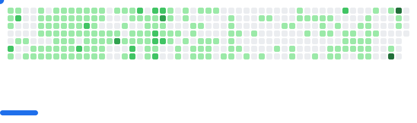

<h2 align="center">Nguyen Luu Tan Sang</h2>
<h3 align="center">Backend Engineer · Java · Spring Boot · Microservices</h3>

  I build production-grade distributed systems — from microservice architecture and real-time geospatial engines to high-concurrency databases. My focus is on correctness under load, clean domain boundaries, and systems that scale.

  📍 Vietnam &nbsp;|&nbsp; 📧 tansang06092004@gmail.com

---

## 🛠️ Tech Stack

**Languages:** Java (primary) · C++ · Python · JavaScript · Shell Script

**Backend:** Spring Boot 3 · Spring Cloud (Eureka, Config, Gateway, OpenFeign) · Spring Security · Resilience4j

**Databases:** PostgreSQL + PostGIS · MySQL 8 · MongoDB (Replica Set) · Redis

**Payments & Auth:** VNPay · JWT · OAuth2 (Google, GitHub)

**Infrastructure:** Docker · Docker Compose · Maven · DigitalOcean · Cloudflare (DNS, SSL, Proxy)

**OS:** Arch Linux (CachyOS) — daily driver

**Frontend:** React · Next.js · Tailwind CSS

**Tools:** IntelliJ IDEA · Postman · Git · GitHub Actions (CI/CD) · Grafana k6

---

## 🚀 Featured Projects

---

### 🎬 Cinestar — Distributed Cinema Booking System

> **Core challenge:** Eliminate double-booking under extreme concurrent load without pessimistic locks.

**[Backend Repo](https://github.com/cinema-Distributed-database/backend)**

A fault-tolerant cinema ticketing platform engineered around a distributed MongoDB architecture, designed to maintain 99.9% uptime and guaranteed seat integrity during blockbuster releases.

**Key Engineering Decisions:**
- **Atomic Concurrency Control** — Replaced the naive "Read-Check-Write" pattern with a single MongoDB atomic update command (`findAndModify` with status validation), eliminating race conditions at the database level without locking overhead
- **ACID Multi-Document Transactions** — Wrapped the full payment-to-seat-confirmation flow in a single Spring `@Transactional` scope: either the user is charged AND their seat is confirmed, or everything rolls back — no ghost bookings
- **4-Node MongoDB Replica Set** — 1 Primary + 3 Secondaries with automatic leader election; Primary failure is recovered in seconds with zero manual intervention
- **Read/Write Separation** — Routed ~90% of read traffic (schedules, seat maps) to Secondary nodes via `secondaryPreferred`, keeping the Primary free for write-critical transactions
- **Soft-Lock Expiry Sweeper** — `@Scheduled` job releases `HOLDING` seats not paid within 5 minutes, maintaining high seat pool turnover
- **Embedded Document Pattern** — Full seat maps stored within each `Showtime` document for O(1) fetch of theater state in a single query
- **2dsphere Geospatial Index** — Efficient "Nearby Cinema" discovery via MongoDB native geo-indexing

**Stack:** Java 21 · Spring Boot 3.3 · MongoDB Replica Set · VNPay · Docker

---

### 🛒 SmartVN — E-Commerce Microservices Platform

> **Core challenge:** Handle high product catalog traffic with near-zero latency under concurrent load.

**[Backend Repo](https://github.com/sangvirgo/microservice-smartVN)**

A production-grade cloud-native e-commerce backend, benchmarked under 100 concurrent virtual users with Grafana k6. Demonstrated **5.5× response time improvement** and **+26% throughput** gain from Redis caching.

**Performance Benchmark (Grafana k6, 100 VUs):**

| Metric | Without Cache | With Redis |
|---|---|---|
| Avg Response | 47.81 ms | 8.66 ms |
| p95 Response | 172.88 ms | 19.11 ms |
| Throughput | 196.8 req/s | 248.5 req/s |
| Failure Rate | 0.02% | **0.00%** |

**Key Engineering Decisions:**
- **Redis Cache-Aside Strategy** — `productDetail` TTL 10 min, `categories` TTL 1 hr, with automatic `@CacheEvict` on write; cache bypass flag for consistency-critical admin reads
- **Internal API Key auth** — Service-to-service calls secured via `X-API-KEY` header, separated from user-facing JWT flows
- **OAuth2 integration** — Google & GitHub login via Spring Security OAuth2, with OTP email verification for standard registration
- **Resilience4j on Admin Service** — Circuit breaker + fallback on all aggregation Feign clients; dashboard degrades gracefully under downstream pressure
- **AI Recommendation Pipeline** — User interactions (VIEW = 1.0, ADD_TO_CART = 2.0, PURCHASE = 3.0) exported for offline recommendation model training

**Stack:** Java 21 · Spring Boot 3.3 · Spring Cloud · MySQL 8 · Redis 7 · VNPay · Docker Compose

---

### 🍔 QuickFood — Full-Stack Food Delivery Platform

> **Core challenge:** Build a complete multi-role delivery ecosystem solo — from DB design to containerized deployment.

**[Backend Repo](https://github.com/sangvirgo/quickfood)**

An end-to-end food delivery platform mirroring UberEats/DoorDash core flows, developed entirely solo. Covers system architecture, backend microservices, real-time geospatial engine, and a multi-role frontend.

**Key Engineering Decisions:**
- **PostGIS Spatial Engine** — Real-time driver location tracking, distance calculation, and delivery radius validation via PostgreSQL + PostGIS
- **Pessimistic Locking for Order Acceptance** — When N drivers race to accept the same `WAITING` order, exactly one wins; all others get a safe rejection — enforced by DB-level transactional lock
- **Database-per-Service** — Core owns `quickfood_core`; Delivery owns `quickfood_delivery` with PostGIS. No shared schema, no domain leakage
- **Netflix Eureka + Spring Cloud Gateway** — Dynamic service discovery with a single JWT-verified entry point for all API traffic
- **One-command infra** — `docker compose up --build -d` brings up all services including both PostgreSQL/PostGIS instances

**Stack:** Java 17 · Spring Boot 3 · Spring Cloud · PostgreSQL + PostGIS · Next.js · Docker Compose

---

### 🧠 Network Intrusion Detection — CNN + LSTM

> **Core challenge:** Detect network attacks in real time using deep learning on sequential traffic data.

A machine learning project applying a hybrid **CNN + LSTM** architecture to network intrusion detection. CNNs extract local feature patterns from packet-level data; LSTM layers capture temporal dependencies across traffic sequences — enabling detection of attack patterns that evolve over time.

- Applied on a real network traffic dataset; model classifies traffic as benign or attack across multiple attack categories
- Demonstrates applied ML beyond standard web development — signal processing, time-series classification, deep learning pipeline

**Stack:** Python · TensorFlow/Keras · CNN · LSTM

---

## 🏗️ Infrastructure & DevOps

Beyond local Docker Compose, I've deployed production workloads end-to-end:

- **DigitalOcean** — provisioned and managed Linux droplets for backend service hosting
- **Cloudflare** — configured custom domains with DNS management, SSL/TLS termination, and reverse proxy for DDoS mitigation
- **GitHub Actions** — set up basic CI/CD pipelines for automated build and deploy workflows
- **Arch Linux (CachyOS)** — daily driver OS; comfortable with system-level configuration, package management (pacman/AUR), and Linux tooling

---

## 🔥 GitHub Streak Stats

<picture>
  <source
    media="(prefers-color-scheme: dark)"
    srcset="images/breakout-dark.svg"
  />
  <source
    media="(prefers-color-scheme: light)"
    srcset="images/breakout-light.svg"
  />
  
</picture>

  

---

  <i>Open to backend engineering roles — distributed systems, high-concurrency, Java/Spring ecosystem.</i> 
  <b>tansang06092004@gmail.com</b>

